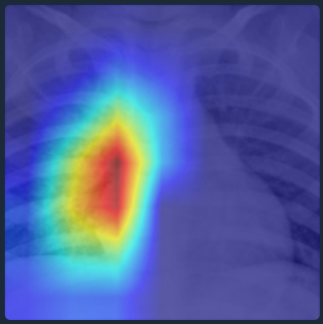
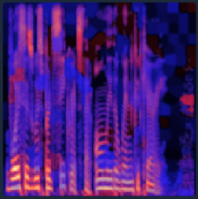
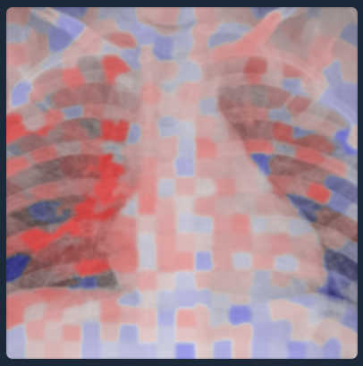
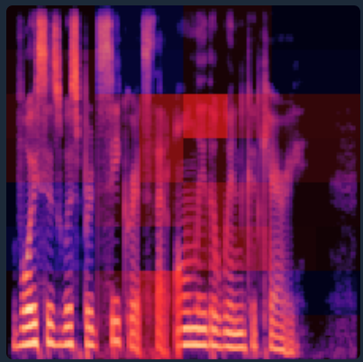
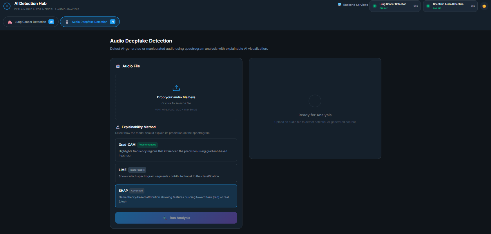

# Unified Explainable AI Interface

## Team Presentation

The team is composed of the following members:
- **Ait Ameur Rachid**
- **Gasperowicz Léo**
- **Barre Florian**
- **Beaurain Loïc**

## Table of Contents

- [I. Introduction](#i-introduction)
  - [a) Context and Motivation](#a-context-and-motivation)
  - [b) Project Objectives](#b-project-objectives)
- [II. Analysis of Original Repositories](#ii-analysis-of-original-repositories)
  - [a) Deepfake Audio Detection Repository](#a-deepfake-audio-detection-repository)
  - [b) Lung Cancer Detection Repository](#b-lung-cancer-detection-repository)
  - [c) Key Limitations and Integration Challenges](#c-key-limitations-and-integration-challenges)
- [III. Deepfake Audio Detection Implementation](#iii-deepfake-audio-detection-implementation)
  - [a) Audio Preprocessing and Spectrogram Generation](#a-audio-preprocessing-and-spectrogram-generation)
  - [b) Model Pipeline and Output](#b-model-pipeline-and-output)
- [IV. Lung Cancer Detection Implementation](#iv-lung-cancer-detection-implementation)
  - [a) Image Preprocessing](#a-image-preprocessing)
  - [b) Model Inference Pipeline](#b-model-inference-pipeline)
- [V. System Architecture and Deployment](#v-system-architecture-and-deployment)
  - [a) Microservices Architecture](#a-microservices-architecture)
  - [b) Service Communication and API Design](#b-service-communication-and-api-design)
  - [c) Containerization and Deployment Strategy](#c-containerization-and-deployment-strategy)
- [VI. Explainable AI Integration](#vi-explainable-ai-integration)
  - [a) Overview of Selected Methods](#a-overview-of-selected-methods)
  - [b) Output Analysis](#b-output-analysis)
  - [c) Why Use Three XAI Methods?](#c-why-use-three-xai-methods)
- [VII. Frontend Implementation](#vii-frontend-implementation)
- [VIII. Conclusion](#viii-conclusion)

---

## I. Introduction

### a) Context and Motivation

Deep learning models increasingly power critical applications, from medical diagnosis to media authenticity verification, yet their decision-making processes remain by definition opaque. Explainable AI (XAI) tries to address this difficulty by visualizing which features drive predictions, enabling domain experts to validate and trust model decisions. However, existing XAI implementations typically remain isolated: bound to specific data modalities, limited to single explanation methods, etc…

To show that it some XAI techniques are adaptable and scalable, this project tries to unify two distinct classification systems into a single XAI platform. The first component, deepfake audio detection trained on the Fake-or-Real dataset, was provided as a two-year-old Streamlit implementation. The second component, lung cancer detection from chest X-rays, was developed entirely from scratch for this project. Both systems required some architectural refactoring and XAI enhancement to enable unified deployment.

### b) Project Objectives

Following the project requirements, this work delivers a unified platform with the following capabilities:

**- Multi-modal input processing**: Audio (.wav) and medical image support through drag-and-drop interface.

**- Multiple model integration**: Classification models for both deepfake detection, refactored from provided repository and lung cancer detection, developed from scratch, adapted to produce a common output format to efficiently connect to the XAI interface.

**- Comprehensive XAI implementation**: Integration of three explainability methods: Grad-CAM, LIME and SHAP.

**- Production-ready architecture**: Complete refactoring from monolithic Streamlit to modular microservices, containerization with Docker and orchestrated deployment for reproducibility, with the step-by-step method precisely defined within the Readme of the project.

The platform serves as both a functional classification tool and an educational instrument for understanding how different XAI approaches, gradient analysis, perturbation sensitivity and coalitional game theory, provide distinct and complementary informations on neural network decision-making.

---

## II. Analysis of Original Repositories

### a) Deepfake Audio Detection Repository

The provided deepfake audio detection system was developed in 2024 as a Streamlit web application for binary classification of audio files using the Fake-or-Real dataset. The implementation consisted of a monolithic script that coupled audio preprocessing, model inference and XAI visualization within a single namespace.

The original codebase implemented two XAI methods: Grad-CAM and LIME. The architecture employed entirely procedural functions with no object-oriented design, hardcoded file paths and no separation between business logic and presentation layer.

The technical stack relied on TensorFlow 2.6.2 and Python 3.9, versions that present compatibility challenges with modern development environments. No containerization was provided, and the exact dependency specifications created version lock-in that complicates deployment on current systems.

### b) Lung Cancer Detection Repository

No existing code was provided within the lung cancer detection repository. This component was developed entirely from scratch by ourr team to demonstrate XAI cross-modal applicability. The pipeline was designed to mirror the deepfake system's structure: binary classification (cancer/no-cancer), standardized 224×224×3 input format and identical XAI method interfaces.

Implementation involved selecting appropriate chest X-ray datasets, adapting pretrained CNNs through transfer learning and implementing precise preprocessing for this type of data, like grayscale-to-RGB conversion or medical image normalization.

### c) Key Limitations and Integration Challenges

Both systems presented some obstacles necessitating some architectural redesigns:

**- Version compatibility:** The deepfake repository's TensorFlow 2.6.2 dependency is incompatible with Python 3.10+, preventing execution on modern environments. Locked dependencies created deployment constraints. Without containerization, developers faced cryptic dependency conflicts during manual environment configuration.

**- Unusable legacy codebase:** The monolithic app.py featured hardcoded paths requiring manual directory setup. No error handling existed and incompatible uploads caused silent failures. Minimal documentation beyond "run streamlit" forced us to reverse-engineer the requirements.

**- No microservices architecture:** Both components were designed as standalone monolithic applications. The deepfake system coupled the preprocessing, model inference, XAI computation and UI within a single Streamlit script. This prevents service reuse, complicates testing and makes horizontal scaling impossible.

**- Lack of modular XAI implementation:** XAI functions existed as unstructured, free-standing procedures without unified interfaces. Adding additional methods required invasive modifications throughout the codebase. No abstraction layer existed to support different model types or preprocessing pipelines.

**- No lung cancer detection implementation:** The lung cancer component was entirely absent, meaning we had to design and implement the preprocessing pipeline, adapt a suitable pretrained model and ensure compatibility with the XAI methods used for the audio detection task.

---

## III. Deepfake Audio Detection Implementation

### a) Audio Preprocessing and Spectrogram Generation

Audio files are converted to spectrograms to provide a spatial representation compatible with convolutional neural networks. The pipeline first loads the audio file using librosa, resampling it to 16kHz for consistency. The Short-Time Fourier Transform (STFT) is then computed to capture time-frequency information, and the magnitude spectrogram is converted to a logarithmic (decibel) scale to better represent human auditory perception.

To normalize the spectrogram into a form suitable for CNN processing, it is scaled to the [0,1] range and resized to 224×224 pixels. Finally, the single-channel grayscale spectrogram is replicated across three channels to match standard RGB input expectations of pretrained models. The output is a 3-dimensional tensor, which can be directly fed into models trained on ImageNet-like datasets.

### b) Model Pipeline and Output

The deepfake detection model is a convolutional neural network fine-tuned on Fake-or-Real spectrograms. It accepts the preprocessed 224×224×3 spectrogram as input and outputs a binary classification: real or fake audio. A sigmoid activation function is applied to the final layer, producing a scalar confidence score between 0 and 1.

The prediction is interpreted using a 0.5 threshold: values above this indicate "fake," and below indicate "real." The confidence score is rounded and displayed as a percentage in the interface. This design ensures consistent formatting across both detection systems and simplifies integration with explainability methods, which expect class-based predictions.

---

## IV. Lung Cancer Detection Implementation

### a) Image Preprocessing

Chest X-ray images undergo several preprocessing steps to ensure compatibility with the model. Images are first loaded from disk and resized to 224×224 pixels, matching the input dimensions expected by pretrained CNNs. If the image is grayscale, which is typical for medical X-rays, it is converted to a three-channel RGB format by replicating the single channel. Pixel values are then normalized to the [0,1] range, which is standard practice when working with CNNs trained on natural images.

This preprocessing pipeline ensures that X-ray inputs are visually similar to ImageNet-like datasets, enabling effective transfer learning. The resulting tensor is a 224×224×3 array that can be directly passed through the classification network.

### b) Model Inference Pipeline

The lung cancer detection model is based on a pretrained convolutional neural network, fine-tuned on a labeled dataset of chest X-rays. The model is loaded with pre-trained weights, which are then adapted to distinguish between cancerous and non-cancerous X-rays through supervised learning.

The input image passes through multiple convolutional and pooling layers, extracting hierarchical features ranging from low-level edges to high-level semantic patterns. The final fully connected layer produces a binary output: cancer present or not present. As with the deepfake detector, a sigmoid activation is applied to the final layer, yielding a confidence score between 0 and 1.

The model inference pipeline is wrapped in an API endpoint to enable integration with the frontend. Predictions are returned alongside confidence scores, processing time and explainability visualizations.

---

## V. System Architecture and Deployment

### a) Microservices Architecture

The unified platform is designed as a microservices system rather than a monolithic application. Three independent services are deployed:

**Frontend service:** Serves the static web interface and routes requests to the appropriate backend.

**Deepfake detection service:** Provides audio classification and XAI generation through a FastAPI endpoint.

**Lung cancer detection service:** Provides medical image classification and XAI generation through a FastAPI endpoint.

This separation ensures fault isolation, independent scalability and parallel development. The backend services communicate solely through HTTP APIs, with no shared state or direct coupling. This design enables different deployment strategies, such as scaling the deepfake service independently during high audio processing loads.

### b) Service Communication and API Design

Inter-service communication is implemented through RESTful HTTP APIs. The frontend serves as the only user-facing component, while backend services remain internal to the Docker network. An Nginx reverse proxy embedded in the frontend dynamically routes requests to the appropriate backend based on URL path patterns, enabling transparent service selection according to the user's chosen detection modality.

Both detection backends expose structured FastAPI endpoints. The deepfake audio detection API accepts audio files and an explainability method selection and returns prediction results, confidence scores, processing time and visual explanation outputs encoded in base64. The lung cancer detection API follows a similar design, adapted to medical image inputs and multi-label predictions. All responses are defined using Pydantic models, ensuring consistent validation, type safety and JSON serialization across services despite differences in underlying frameworks.

### c) Containerization and Deployment Strategy

Each service is containerized using a dedicated Dockerfile that specifies exact dependency versions. This isolation strategy directly resolves the dependency conflicts identified in earlier system iterations.

Docker Compose is used to orchestrate the multi-container setup, defining a custom bridge network that enables secure inter-service communication. Only the frontend exposes a port to the host system, enforcing a gateway pattern that prevents direct external access to backend services.

Both backend containers optionally support NVIDIA GPU acceleration for model inference, with graceful fallback to CPU execution when GPU resources are unavailable. A separate development configuration enables hot-reload and direct API access for testing while preserving a production-like deployment structure.

---

## VI. Explainable AI Integration

### a) Overview of Selected Methods

The platform integrates three complementary Explainable AI (XAI) methods, Grad-CAM, LIME and SHAP, chosen for their fundamentally different approaches to model interpretation.

**Grad-CAM** uses gradient information within convolutional neural networks to identify spatial regions that most influence the predicted class. By weighting feature maps of the final convolutional layer with class-specific gradients, it produces coarse heatmaps highlighting discriminative regions. This method requires access to model internals but is computationally efficient.

*Figure 1: Grad-CAM for Deepfake Detection*

*Figure 2: Grad-CAM for Cancer Detection*

**LIME** treats the model as a black box and explains predictions through local perturbations. The input image is segmented into superpixels, which are randomly masked to generate perturbed samples. A local linear model is then fitted to approximate the classifier's behavior around the original input, identifying regions that support or oppose the prediction. LIME is model-agnostic but computationally more expensive.

*Figure 3: LIME for Deepfake Detection*

*Figure 4: LIME for Cancer Detection*

**SHAP** is based on game theory and assigns a contribution score to each region of the input, showing how much it influences the model's prediction. For images, these contributions are estimated by testing different combinations of image regions. Although this method is computationally expensive, it provides reliable and mathematically well-founded explanations.

*Figure 5: SHAP for Deepfake Detection*

### b) Output Analysis

Each method produces distinct visual explanations reflecting its underlying principles. Grad-CAM generates smooth heatmaps highlighting regions of high model sensitivity, such as specific frequency-time patterns in audio spectrograms or suspicious anatomical regions in chest X-rays. LIME produces irregular, superpixel-based visualizations, where colors indicate regions that support or contradict the prediction. SHAP outputs grid-like patch attributions, with positive and negative contributions clearly separated and additive by construction.

Comparing these outputs provides insight into model behavior. Convergence across methods suggests robust and consistent reasoning, while divergence may indicate reliance on multiple features, spurious correlations, or model instability.

### c) Why Use Three XAI Methods?

Using three XAI techniques provides complementary perspectives that no single method can offer alone. Grad-CAM inspects internal gradient flow, LIME probes external input-output behavior and SHAP delivers principled attributions. This diversity reduces the risk of misleading explanations and increases trustworthiness.

The methods also offer practical trade-offs: Grad-CAM enables fast analysis, LIME provides intuitive explanations accessible to everyone and SHAP offers rigorous justifications suited for high-stakes domains. Their varying spatial granularities further enhance interpretability.

As you can see in the screenshots, having three XAI models can also be used to compare the results.

---

## VII. Frontend Implementation

The frontend provides a unified user interface that abstracts the underlying multi-backend architecture while offering intuitive access to classification and explainability features. It is implemented as a static single-page application, prioritizing simplicity, performance and ease of deployment over the use of heavy frontend frameworks.

*Figure 6: Unified Frontend Interface*

The application is built using vanilla HTML, CSS and JavaScript, organized into modular directories separating UI components, API services, view logic and core state management. This structure maintains readability and scalability without introducing dependencies on frameworks such as React or Vue. Static files are served through an Nginx Alpine container, which also handles reverse proxying to backend services. Docker-based DNS resolution enables dynamic service routing without hardcoded addresses.

Users access the platform through a single entry point and begin by selecting the analysis modality, either deepfake audio detection or lung cancer detection. This choice dynamically adapts the interface: accepted file formats are updated accordingly, available XAI methods are filtered to ensure compatibility and requests are automatically routed to the appropriate backend service.

File upload is handled via a drag-and-drop interface with client-side validation of format and size. Files are sent to the backend using multipart form-data requests routed through Nginx. The frontend provides real-time feedback on upload status and displays clear error messages in case of invalid inputs or network failures.

Explainability methods are selected directly within the menu. Classification results are displayed in structured panels showing the predicted label, confidence score and processing time. XAI outputs are rendered as decoded PNG heatmaps alongside the original input, with color legends clarifying attribution semantics.

Note that by delegating computation entirely to backend microservices and serving static assets through Nginx, the interface remains lightweight and scalable.

---

## VIII. Conclusion

This project demonstrates the successful integration of two initially independent XAI systems, a deepfake audio detector and a lung cancer classifier, into a unified, multi-modal and interpretable AI platform. By transitioning from a monolithic Streamlit implementation to a microservices architecture based on containerized FastAPI backends, major dependency conflicts were resolved while enabling modularity, scalability and maintainability.

The use of three complementary explainability methods, Grad-CAM, LIME, and SHAP, provides diverse and mutually reinforcing insights into model behavior. Comparing explanations across these methods helps identify consistent decision patterns as well as potential instabilities or biases.

Overall, the project underlines the importance of combining robust system architecture with explainable AI methods to build reliable, transparent and extensible AI applications suitable for critical real-world domains.

---

## Disclosure of Generative AI Usage

This project involved the use of Generative Artificial Intelligence tools (ChatGPT and Claude) to assist with code refactoring, debugging, and conceptual clarification.

The AI tools were used strictly as support. All core ideas, system design, implementation decisions, training procedures, evaluation, and interpretations were performed and validated by the project team.
